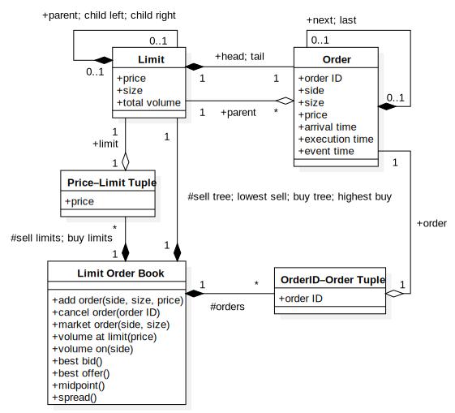

# Limit Order Book (LOB)

[![build-status][]][build-server]
[![PackageVersion][pypi-version]][pypi-home]
[![PythonVersion][python-version]][python-home]
[![Stable][pypi-status]][pypi-home]
[![Format][pypi-format]][pypi-home]
[![License][pypi-license]](LICENSE)

[build-status]: https://travis-ci.com/Kautenja/limit-order-book.svg
[build-server]: https://travis-ci.com/Kautenja/limit-order-book
[pypi-version]: https://badge.fury.io/py/limit-order-book.svg
[pypi-license]: https://img.shields.io/pypi/l/limit-order-book.svg
[pypi-status]: https://img.shields.io/pypi/status/limit-order-book.svg
[pypi-format]: https://img.shields.io/pypi/format/limit-order-book.svg
[pypi-home]: https://badge.fury.io/py/limit-order-book
[python-version]: https://img.shields.io/pypi/pyversions/limit-order-book.svg
[python-home]: https://python.org

This is an implementation of the limit order book structure and matching
algorithm for C++ (and Python through ctypes) for market data streaming.



## Usage

### C++

Simply add [include/*.hpp](include) to your C++ project either by copying
directly or using git submodules.

### Python

The preferred Python installation of `limit-order-book` is from `pip`:

```shell
pip install limit-order-book
```

### Windows

You'll need to install the Visual-Studio 17.0 tools for Windows installation.
The [Visual Studio Community](https://visualstudio.microsoft.com/downloads/)
package provides these tools for free.

## Testing

To run all the unit-test suites, run:

```shell
make test
```

### C++

To run the C++ unit-test suite, run:

```shell
scons test
```

### Python

To run the Python unit-test suite, run:

```shell
python -m unittest discover .
```

## Benchmarking

### C++

To run the C++ benchmark code, run:

```shell
scons benchmark
```
